# 약국 추천 서비스
- 프로젝트를 진행하면서 배운점들을 기록
- `handlebars`템플릿엔진으로 진행하면서 어려움을 겪어 `UI` 구성보다는 `API`개발을 위주로 진행하였고 `Postman`으로 확인
- ### [전체 코드](https://github.com/Ho-Tea/toy_project-Pharmacy/tree/main/pharmacy)

## 목차
  - [**개발환경**](#개발환경-구성)
    - [**도커**](#도커)
    - [**도커 컴포즈**](#도커-컴포즈)
  - [**Spring Profile**](#spring-profile)
  - [**Testcontainers**](#testcontainers )
  - [**Mock**](#mock)
  - [**Mock MVC**](#mock-MVC-(컨트롤러-layer-테스트-전용))
  - [**Stub**](#stub)
  - [**@Transactional**](#@transactional)
  - [**Spring Retry**](#spring-retry)
  - [**Kakao API**](#kakao-api)
  - [**Build**](#build)
  - [**Redis**](#redis)
  - [**배포**](#배포)
  - [**Problem**](#problem)


------------


- ### 개발환경 구성
  - JDK 17
  - Spring Boot 3.0.5
  - Gradle Wrapper
  - Lombok
  - Spring Configuration Processor
    - `application.properties`, `application.yml`의 자동완성을 지원
  - Spring Web
  - Spring Data Jpa
  - Maria DB
  - Spock
    - `Groovy` 언어를 이용하여 테스트 코드를 작성할 수 있는 프레임워크이며<br> JUnit 과 비교하여 코드를 더 간결하게 작성 가능하다.
    - `Groovy` 언어는 동적 타입 프로그래밍 언어로 JVM 위에서 동작하며 Java문법과 유사하다.
    - `Groovy`클래스로 생성하고, `Specification`클래스를 상속받는다
  - Handlebars
    - 자바 템플릿 엔진
  

  - ### 도커
    - `컨테이너`를 사용하여 응용프로그램을 더 쉽게 만들고 배포하고 실행할 수 있도록 설계된 도구
    - `일반 컨테이너 개념에서 물건을 손쉽게 운송해주는 것`처럼 <br> 어플리케이션 환경에 구애받지 않고 손쉽게 배포관리가 가능
    - 도커는 **서버마다 동일한 환경**을 구성해준다
    - 동일한 환경을 구성하기 때문에 `auto scaling`에 유리하다
      - `auto scaling` : 서버를 늘리고 줄이고를 자동으로 해준다
    - 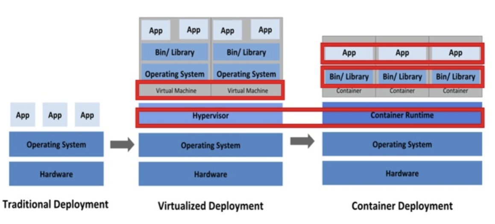
      - 도커는 하이퍼 바이저 구조를 토대로 등장
      - VM보다 훨씬 가볍게 동작 -> 성능에 유리
    - **도커 이미지**
      - 코드, 런타임, 시스템 도구, 시스템 라이브러리 및 설정과 같은 응용프로그램을<br> 실행 하는데 필요한 모든것을 포함한 패키지
      - **컨테이너란 도커 이미지를 독립된 공간에서 실행 할 수 있게 해주는 기술**

    - **도커 파일**
      - Dockerfile이란 도커 이미지를 구성하기 위해 있어야 할 패키지, 의존성, 소스코드 등을<br> 하나의 file로 기록하여 이미지화 시킬 명령 파일
      - 즉, 이미지는 컨테이너를 실행하기 위한 모든 정보를 가지고 있기 때문에 <br>더 이상 새로운 서버가 추가되면 의존성 파일을 컴파일하고 이것저것 설치할 필요가 없다

      - 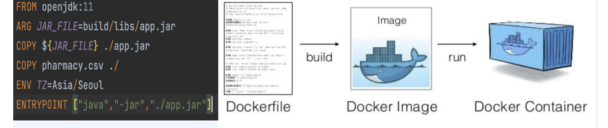

      - 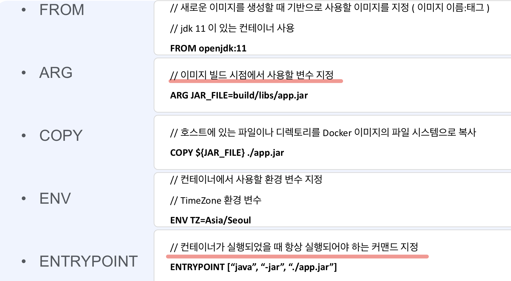

  - ### 도커 컴포즈
    - 멀티 컨테이너 도커 어플리케이션을 정의하고 실행하는 도구
    - Application, Database, Redis, Nginx 등 각 독립적인 컨테이너로 관리한다고 했을 때<br> **다중 컨테이너 라이프 사이클을 파일하나(`docker-compose.yml`) 작성으로 관리 가능**
    - 여러개의 도커 컨테이너로 부터 이루어진 서비스를 구축 및 네트워크 연결, 실행 순서를 자동으로 관리
    - 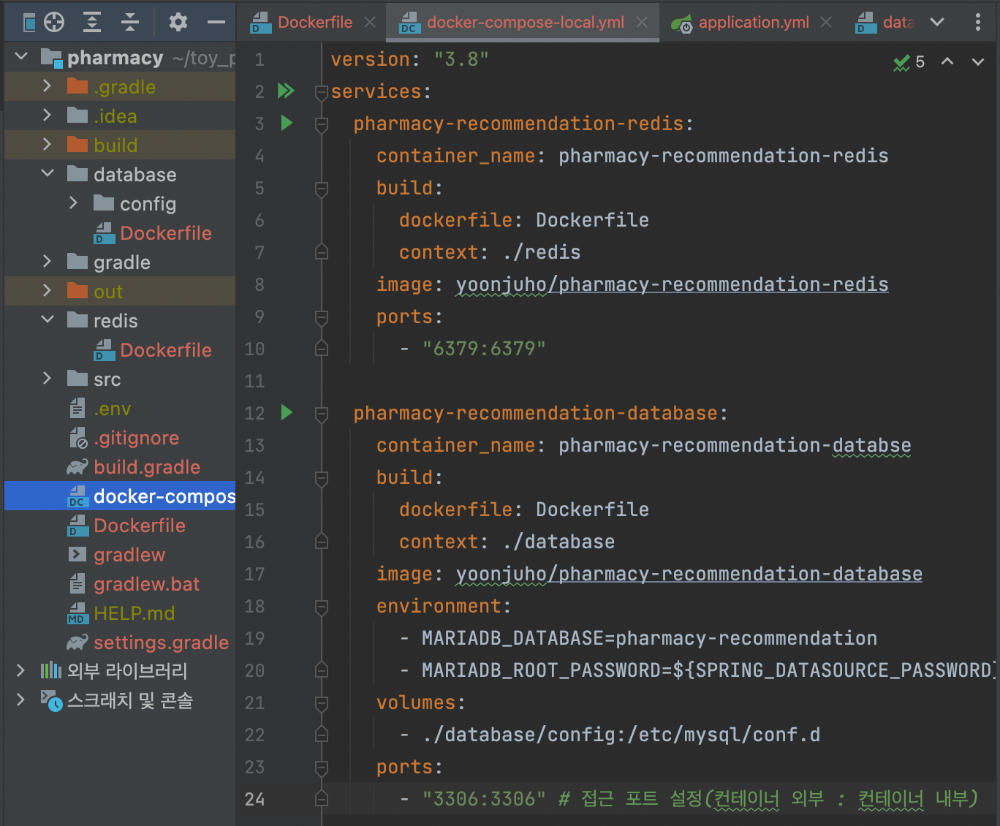
    - `Docker compose`에서 환경 변수 정보들을 분리하여 별도의 파일로 구성할때 <br> 간편한 방법은 Compose파일이 위치한 경로에 .env파일을 구성
    - 작성한 .env 파일은 별다른 설정 없이 Docker Compose에 바로 반영
    - 비밀정보가 코드에 노출되지 않도록 .gitignore에 .env파일 추가


- ### Spring Profile
  - 복수의 WAS를 사용하는 상황에서 같은 Spring Application을 사용하지만 **각 Server에 맞게 Context를 설정해야 하는 경우가 존재**
  - 환경 별(local, develop, production)
    - ``` yml
      spring:
        profiles:
          active: local # default
          group:
            local:
              - common
            prod:
              - common


        ---

        spring:
          config:
            activate:
              on-profile: common

        kakao:
          rest:
            api:
              key: ${KAKAO_REST_API_KEY}


        ---
        spring:
          config:
            activate:
              on-profile: local
          datasource:
            driver-class-name: org.mariadb.jdbc.Driver
            url: jdbc:mariadb://localhost:3306/pharmacy-recommendation
            username: ${SPRING_DATASOURCE_USERNAME}   # 디비 접속과 관련된 부분이니 env파일에 따로 저장하고 환경변수로 지정하여 주입받는다
            password: ${SPRING_DATASOURCE_PASSWORD}
          jpa:
            hibernate:
              ddl-auto: create
            show-sql: true
          data:
            redis:
              host: localhost
              port: 6379

          ---
          spring:
            config:
              activate:
                on-profile: prod


          ---

      ```

- ### 추천 서비스 기능 구현
  - ### Testcontainers 
    - JPA를 이용하여 CRUD **테스트 코드**를 작성할 때 어떤 DB환경이 좋을까?
      1. 운영환경과 유사한 스펙의 DB사용하기<br> (다른사용자가 CRUD하는 상황이면 Data가 바뀔 수 있다)
      2. 인메모리 DB(`H2`)사용하기
      3. Docker 이용하기<br> (DB가 담긴 Container가 올라가는 시점과 테스트가 실행되는 시점을 맞추는 작업이 추가로 필요하게 된다)
      4. **TestContainer를 이용하기**
      - TestContainer는 운영환경과 유사한 DB스펙으로 독립적인 환경에서 테스트코드를 작성하여 테스트 가능
      - 즉, 테스트 코드가 실행 될 때 자동으로 도커 컨테이너를 실행하여 테스트하고,<br> 테스트가 끝나면 자동으로 컨테이너를 종료 및 정리한다
      - 테스트컨테이너를 실행하기 위해서는 도커가 실행되어 있어야 한다.

      ``` groovy
      // groovy(Spock), Testcontainer
      @SpringBootTest
      abstract class AbstractIntegrationContainerBaseTest extends Specification{  //테스트를 위한 상속
        static final GenericContainer MY_REDIS_CONTAINER    //redis의 경우에는 따로 추가해주어야 한다

        static {
          MY_REDIS_CONTAINER = new GenericContainer<>("redis:6").withExposedPorts(6379)

          MY_REDIS_CONTAINER.start();

          System.setProperty("spring.redis.host", MY_REDIS_CONTAINER.getHost())
          System.setProperty("spring.redis.port", MY_REDIS_CONTAINER.getMappedPort(6379).toString())//redis를 스프링에게 알려주어야 한다

        }
      }
      ```
      ``` yml
      # Test (application.yml)
      # jdbc: 이후 tc:를 추가하면, host와 port, database name은 무시되며, 
      # testcontainers가 제공해주는 드라이버가 자동으로 처리한다

      spring:
        datasource:
          driver-class-name: org.testcontainers.jdbc.ContainerDatabaseDriver
          url: jdbc:tc:mariadb:10:///pharmacy-recommendation
        jpa:
          hibernate:
            ddl-auto: create
          show-sql: true

      kakao:
        rest:
          api:
            key: ${KAKAO_REST_API_KEY}
      ```

  - ### Mock
    - Mockito : Mock객체를 쉽게 만들고, 관리하고, 검증할 수 있는 방법을 제공하는 프레임워크.
    - 실제 객체를 만들어 사용하기에 시간, 비용등의 Cost가 높거나 혹은 객체 서로간의 의존성이 강해<br> 구현하기 힘들 경우 가짜객체를 만들어 사용하는 방법이다
    - `private PharmacySearchService pharmacySearchService = Mock()`

    - 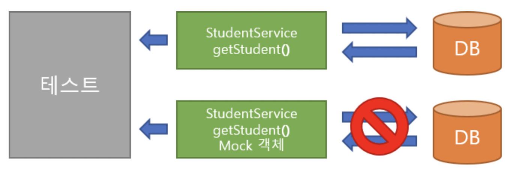


    - **MockWebServer**
       ``` java
        //extends를 받음으로 통합테스트환경에서 진행
        class KakaoAddressSearchServiceRetryTest extends AbstractIntegrationContainerBaseTest {

        @Autowired
        private KakaoAddressSearchService kakaoAddressSearchService

        // MockWebServer로 띄울 예정인데 kakaoservice는 실제 카카오 uri를 가리키기 때문에
        //실제 카카오 api를 호출해서 응답값을 받는게 아니라 서버를 Mocking 할 수 있는 MockWebServer를 사용한다
        //@MockBean -> 스프링 컨테이너 안에 들어있는 빈을 Mocking한다
        //스프링 컨테이너가 필요하고 빈이 컨테이너안에 존재한다면 @MockBean 사용
        @SpringBean //-> spock에서 사용한다
        private KakaoUriBuilderService kakaoUriBuilderService = Mock()

        private MockWebServer mockWebServer

        ...
      ```
      ``` groovy
      def "requestAddressSearch retry success"() {
        given:
        def metaDto = new MetaDto(1)
        def documentDto = DocumentDto.builder()
                .addressName(inputAddress)
                .build()
        def expectedResponse = new KakaoApiResponseDto(metaDto, Arrays.asList(documentDto))
        def uri = mockWebServer.url("/").uri() // 설정

        when:
        mockWebServer.enqueue(new MockResponse().setResponseCode(504))
        mockWebServer.enqueue(new MockResponse().setResponseCode(200)
                .addHeader(HttpHeaders.CONTENT_TYPE, MediaType.APPLICATION_JSON_VALUE)
                .setBody(mapper.writeValueAsString(expectedResponse)))  // 설정

        def kakaoApiResult = kakaoAddressSearchService.requestAddressSearch(inputAddress)
        def takeRequest = mockWebServer.takeRequest()

        then:
        2 * kakaoUriBuilderService.buildUriByAddressSearch(inputAddress) >> uri //Stub
        takeRequest.getMethod() == "GET"
        kakaoApiResult.getDocumentList().size() == 1
        kakaoApiResult.getMetaDto().totalCount == 1
        kakaoApiResult.getDocumentList().get(0).getAddressName() == inputAddress

        }
      ```

    - ### Mock MVC (컨트롤러 Layer 테스트 전용)
      - Web API를 테스트한다는 것은 WAS를 실행해야만 된다는 문제가 있다
        - 톰캣같은 WAS가 java파일을 컴파일해서 class로 만들고 메모리에 올려 서블릿 객체를 만든다
      - 컨트롤러를 테스트하고 싶을 때 실제 서버에 구현한 어플리케이션을 올리지 않고(**실제 서블릿 컨테이너를 사용하지 않고**) 테스트용으로 시뮬레이션하는 것
      - 매번 직접 서버를 띄우고 브라우저를 통해서 테스트하지 않고 테스트 코드를 통해 검증 가능
      - 웹 환경에서 컨트롤러를 테스트하려면 서블릿 컨테이너가 구동되고 `DispatcherServlet`객체가 메모리에 올라가야 한다. <br> 이때 서블릿 컨테이너를 모킹하면 실제 서블릿 컨테이너가 아닌 테스트 모형 컨테이너를 사용해서 간단하게 컨트롤러를 테스트 할 수 있다

        ``` java

        class FormControllerTest extends Specification {

        private MockMvc mockMvc
        private PharmacyRecommendationService pharmacyRecommendationService = Mock()
        private List<OutputDto> outputDtoList

        def setup() {
          // FormController MockMvc 객체로 만든다.
          mockMvc = MockMvcBuilders.standaloneSetup(new FormController(pharmacyRecommendationService))
                .build()

          outputDtoList = new ArrayList<>()
          outputDtoList.addAll(
                OutputDto.builder()
                        .pharmacyName("pharmacy1")
                        .build(),
                OutputDto.builder()
                        .pharmacyName("pharmacy2")
                        .build()
          )
        }

        def "GET /"() {

        expect:
          // FormController 의 "/" URI를 get방식으로 호출
          mockMvc.perform(get("/"))
                .andExpect(handler().handlerType(FormController.class))
                .andExpect(handler().methodName("main"))
                .andExpect(status().isOk()) // 예상 값을 검증한다.
                .andExpect(view().name("main"))
                .andDo(log())
        }

        def "POST /search"() {

        given:
          String inputAddress = "서울 성북구 종암동"

        when:
          def resultActions = mockMvc.perform(post("/search")
                .param("address", inputAddress))

        then:
          1 * pharmacyRecommendationService.recommendPharmacyList(argument -> {
            assert argument == inputAddress // mock 객체의 argument 검증
          }) >> outputDtoList

        resultActions
                .andExpect(status().isOk())
                .andExpect(view().name("output"))
                .andExpect(model().attributeExists("outputFormList")) // model에 outputFormList라는 key가 존재하는지 확인
                .andExpect(model().attribute("outputFormList", outputDtoList))
                .andDo(print())
          }
        }
        ```


  - ### Stub
    - Stub은 테스트 중에 만들어진 호출에 미리 준비된 답변을 제공하며 <br> 일반적으로 테스트를 위해 프로그래밍된 것 외에는 전혀 응답하지 않습니다.
    - `pharmacySearchService.searchPharmacyDtoList() >> pharmacyList   //stub (반환값을 지정)` 


  - ### @Transactional
    - `@Transactional`은 **스프링 AOP**기반이며, **스프링 AOP**는 Proxy기반으로 동작한다
    - `@Transactional`이 포함된 메서드가 호출될 경우, 프록시 객체를 생성하으로써<br> **트랜잭션 생성 및 커밋 또는 롤백** 후 **트랜잭션 닫는 부수적인 작업**을 프록시 객체에게 위임한다
    - 프록시의 핵심적인 기능은 지정된 메서드가 호출될때 <br> 이 메서드를 가로채어 부가기능 들을 프록시 객체에게 위임한다
    - 개발자가 메서드에 `@Transactional`만 선언하고, 비즈니스 로직에 집중 가능

      - **Self Invocation 문제**
        - 스프링 AOP를 기반으로 하는 기능들(`@Transactional`, `@Cacheable`, `@Async`)사용시 발생 가능
        - 메서드가 호출되는 시점에 프록시 객체를 생성하고,<br> 프록시 객체는 부가기능(트랜잭션)을 주입해 준다

        - 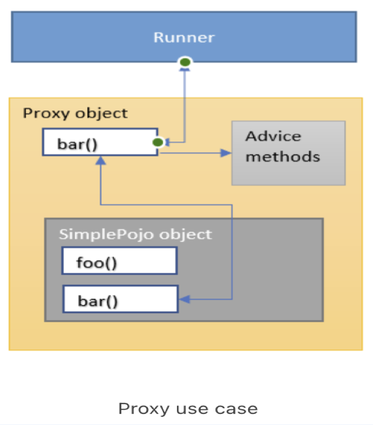

        - 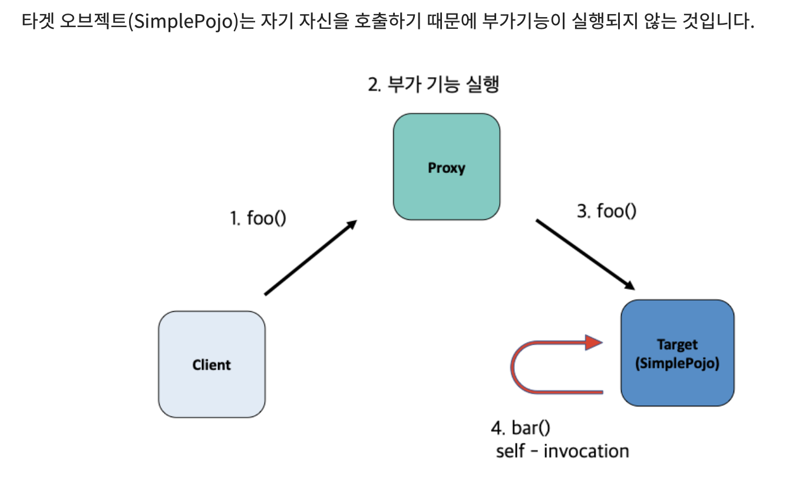

        - 외부에서 `bar()`메서드를 실행할 때 정상적으로 프록시가 동작한다
        - 하지만, `@Transactional` 을 `foo()`에만 선언하고 외부에서 `bar()`를 호출하고,<br> `bar() -> foo()` 호출했다고 가정 `bar()`에 `@Transactional`에 관한 설명이 없다면 `Proxy`객체가 생성되지 않는다 <br> **내부호출에 관해서는 Proxy가 동작하지 않는다**

        - **해결방법**
          1. 트랜잭션 위치를 외부에서 호출 하는 `bar()`메서드로 이동
          2. 객체의 책임을 최대한 분리하여 외부 호출 하도록 리팩토링


  - ### Spring Retry
    - Spring Retry는 실패한 동작을 자동으로 다시 호출하는 기능을 제공
    - 일시적인 네트워크 결함과 같이 오류가 일시적일 수 있는 경우에 유용하다
    - 재처리를 할때 3가지 고려사항
      1. 재시도를 몇 번 실행할 것인가?
      2. 재시도 하기 전에 지연시간을 얼마나 줄 것인가?
      3. 재시도를 모두 실패했을 경우 어떻게 처리할 것인가?
    - **Retry with annotations** (retry Template을 사용하는 방법도 존재)
      - Spring Retry를 활성화하려면 `@EnableRetry` 어노테이션 추가
      ``` java
      @EnableRetry
      @Configuration
      public class RetryConfig{
        
      }
      ```
      - 재시도 기능을 추가할 메서드 위에 `@Retryable`
      ``` java
      @Retryable(
        value = {Exception.class},
        maxAttempts = 2,
        backoff = @Backoff(delay = 2000)
      )
      public KakaoApiResponseDto requestAddressSearch(String address) { }
      ```
      - `fallback`처리할 수 있는 기능 제공 (모두 실패시) `return Type`을 맞춰주어야 한다, `Parameter`도 사용가능
      ``` java
      @Recover
      public KakaoApiResponseDto recover (Exception e, String address){
        log.error("All the retries failed address : {}, error : {}", address, e.getMessage());
        return null;
      }
      ```

  - ### Kakao API
    - 카테고리로 장소 검색하기

      - 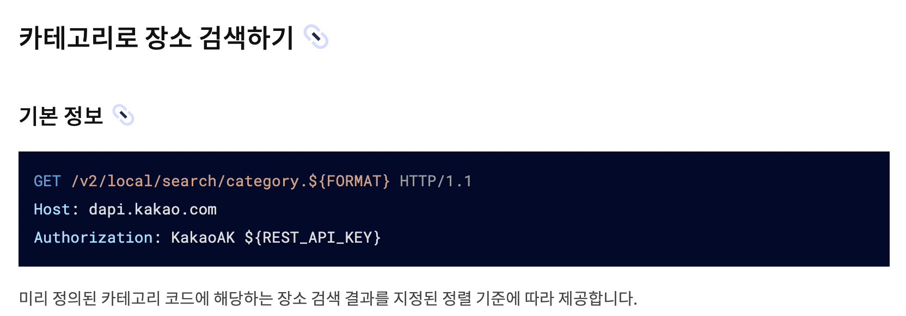

      - 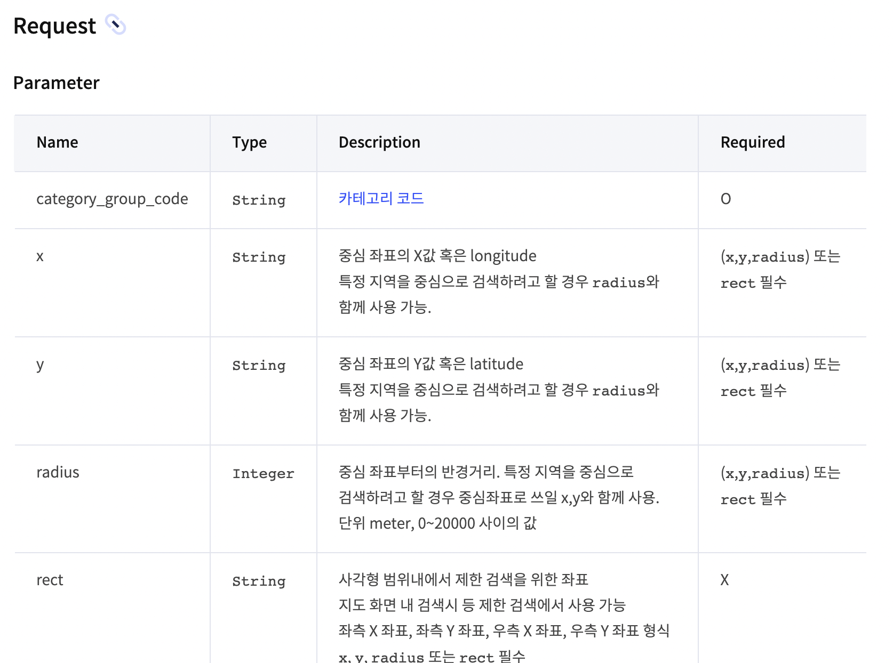

      - 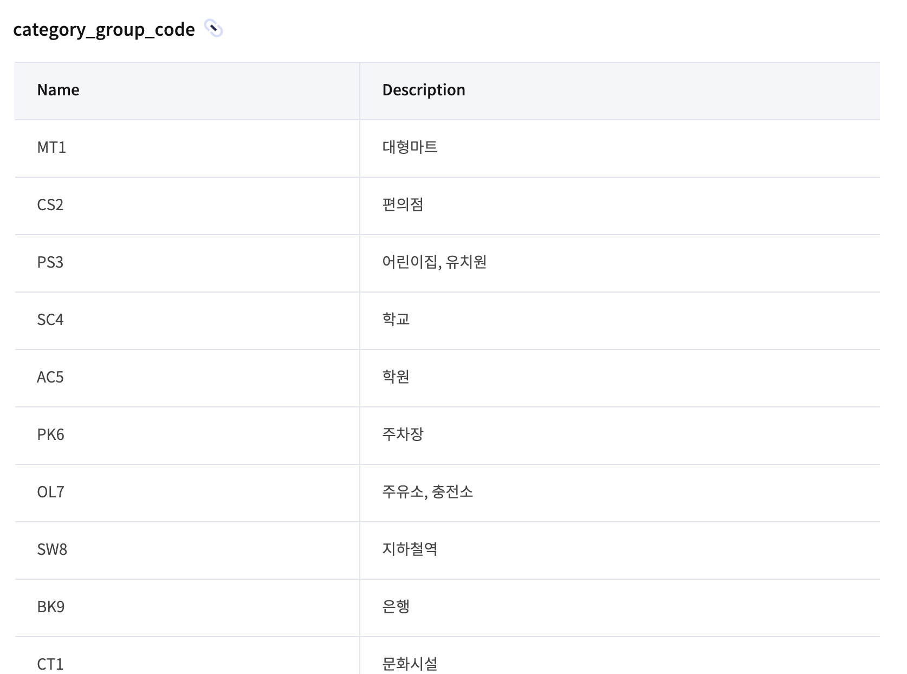
      
      - 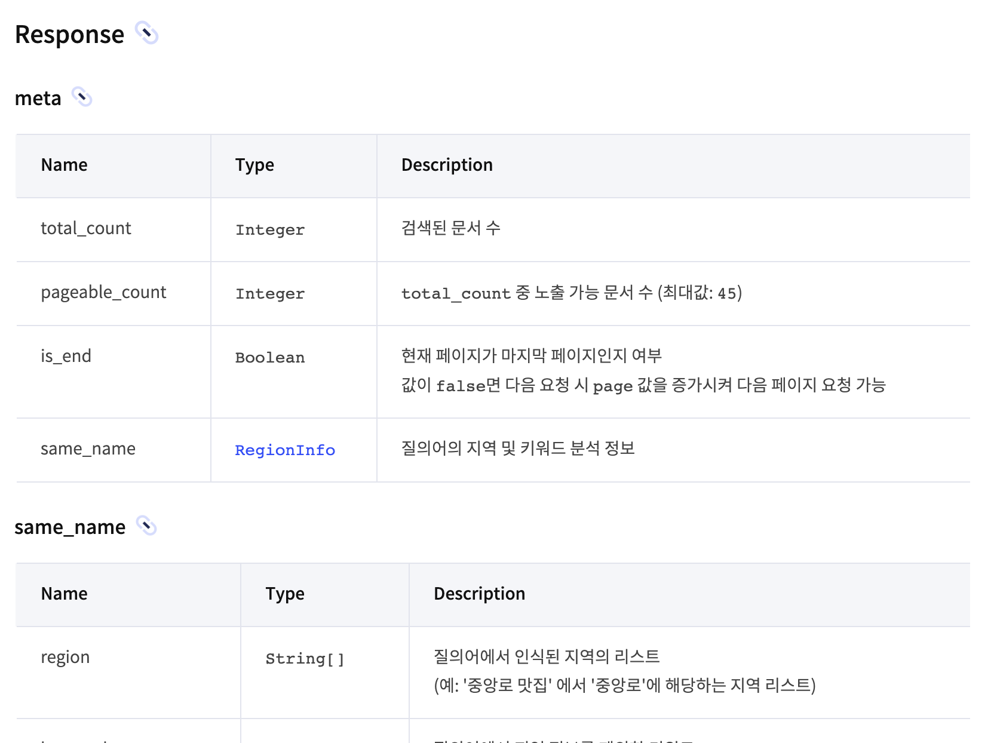

      - 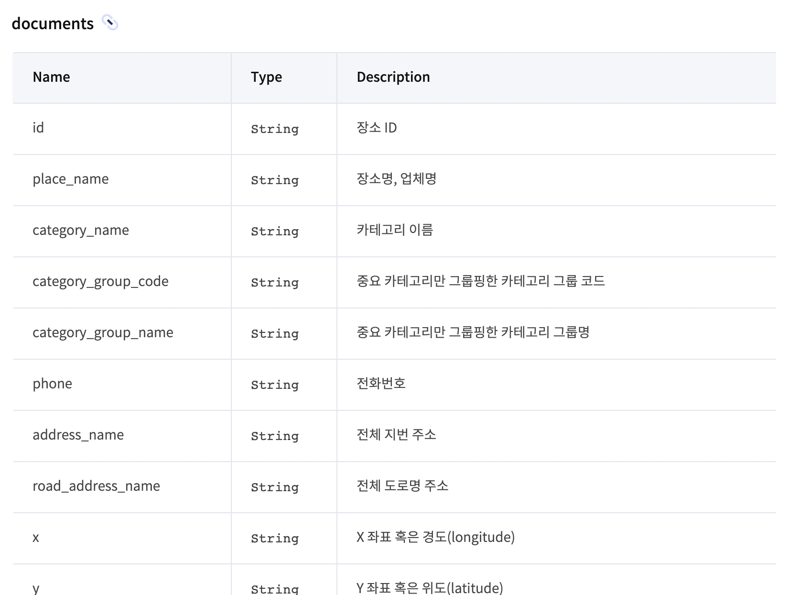

      - 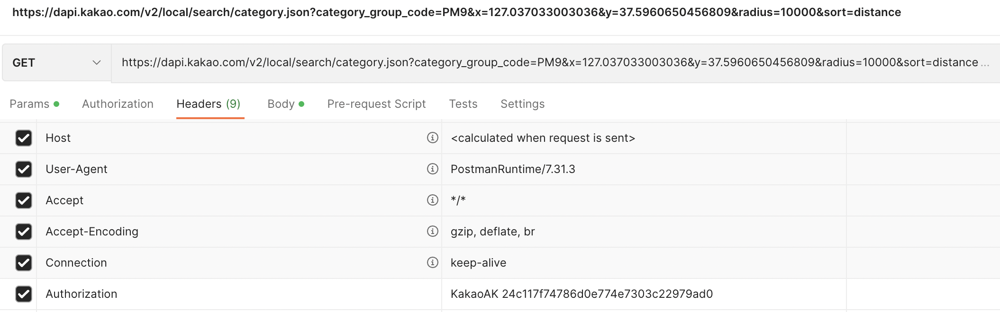

      - 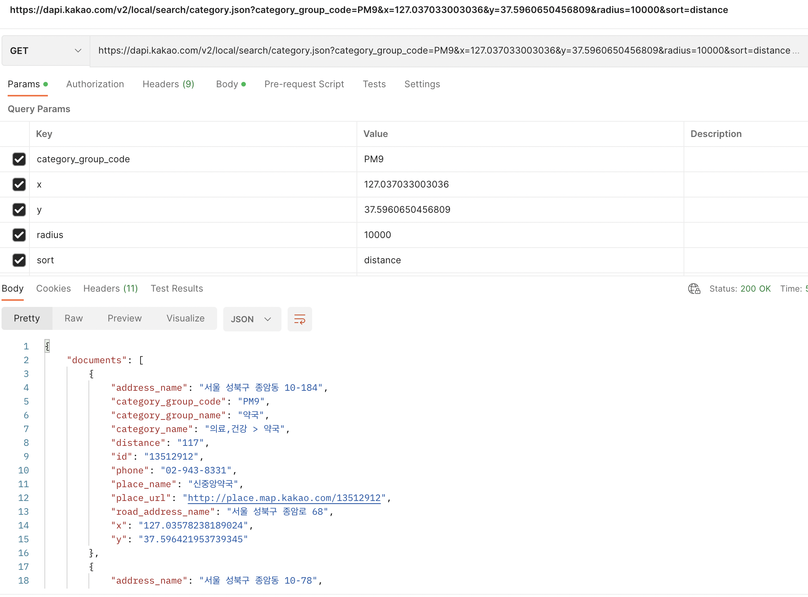

      ``` java
      // 요약 코드
      // Dto
      @Getter
      @AllArgsConstructor
      @NoArgsConstructor
      public class KakaoApiResponseDto {

        @JsonProperty("meta")
        private MetaDto metaDto;

        @JsonProperty("documents")
        private List<DocumentDto> documentList;


        // Service
        @Slf4j
        @Service
        public class KakaoUriBuilderService {

          private static final String KAKAO_LOCAL_SEARCH_ADDRESS_URL = "https://dapi.kakao.com/v2/local/search/address.json";

          private static final String KAKAO_LOCAL_CATEGORY_SEARCH_URL = "https://dapi.kakao.com/v2/local/search/category.json";

          public URI builderUriByAddressSearch(String address){
            UriComponentsBuilder uriBuilder = UriComponentsBuilder.fromHttpUrl(KAKAO_LOCAL_SEARCH_ADDRESS_URL);
          uriBuilder.queryParam("query", address);    //쿼리 파라미터 생성
          URI uri = uriBuilder.build().encode().toUri();

          log.info("address : {}, URI : {}",address,uri);

          return uri;
        }
        public URI buildUriByCategorySearch(double latitude, double longitude, double radius, String category) {

          double meterRadius = radius * 1000;

          UriComponentsBuilder uriBuilder = UriComponentsBuilder.fromHttpUrl(KAKAO_LOCAL_CATEGORY_SEARCH_URL);
          uriBuilder.queryParam("category_group_code", category);
          uriBuilder.queryParam("x", longitude);
          uriBuilder.queryParam("y", latitude);
          uriBuilder.queryParam("radius", meterRadius);
          uriBuilder.queryParam("sort","distance");

          URI uri = uriBuilder.build().encode().toUri();

          log.info("[KakaoAddressSearchService buildUriByCategorySearch] uri: {} ", uri);

          return uri;
        }
      }
      ```

  - ### Build
    - `jar`파일을 `build`하는 과정에서 전체 Test코드 또한 검증해 준다
      - KAKAO_REST_API_KEY를 넣어줄려면 `./gradlew clean build -PKAKAO_REST_API_KEY=fdklsjkldmsal`로 구성하자
    - (도커 컨테이너가 실행되고 있는 상태여야 한다)
    ``` groovy
    //application.yml
    // gradlew clean build -PKAKAO_REST_API_KEY={api key 값} 명령어로 전체 테스트 및 빌드하여 jar파일 생성
    processTestResources {
	  boolean hasProperty = project.hasProperty("KAKAO_REST_API_KEY")
	  println ("Set KAKAO rest api key : $hasProperty()")
	  filesMatching('**/application.yml') {
		  expand(project.properties)
	  }
    }
    ```
  - ### Redis
    - Redis는 오픈소스이며, In-Memory 데이터베이스로써 다양한 자료구조(Hash,List)를 제공
    - 메모리 접근이 디스크 접근보다 빠르기 때문에 데이터베이스(`Mysql`, `Oracle`...)보다 빠르다
      - 자주사용하는데이터 && 크게 변하지않는(Update가 자주 일어나지 않는) 데이터를 넣어놓는다 -> **성능 이득**
    
    - 현상황 : request 마다 약국데이터를 매번 DB에서 조회, 거리계산 알고리즘 계산 및 정렬 후 결과값 반환
    - 너무 많은 `update`가 일어나는 데이터일 경우, DB와의 `Sync` 비용이 발생
    - `Redis` 사용시 반드시 `failover`에 대한 고려
      - 레디스 장애시 데이터베이스에서 조회(디비에서 조회하는 로직을 추가해야 한다)<br> **레디스 이중화 및 백업**
        ```java

        public List<PharmacyDto> searchPharmacyDtoList() {

        //redis
        List<PharmacyDto> pharmacyDtoList = pharmacyRedisTemplateService.findAll();
        if(!pharmacyDtoList.isEmpty())
            return pharmacyDtoList;

        //db
        return pharmacyService.findAll()
                .stream()
                .map(entity -> convertToPharmacyDto(entity))
                .collect(Collectors.toList());
        }
        ```
      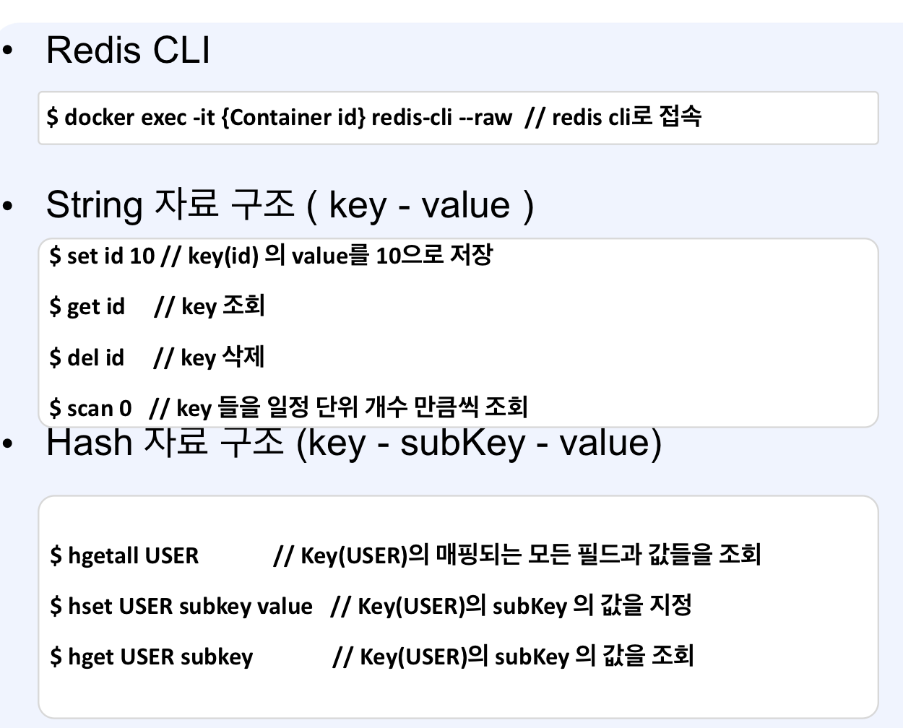
      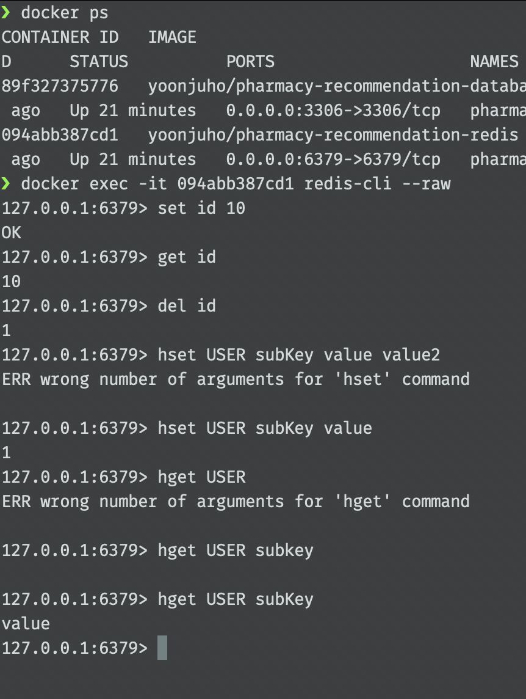


  - ### 배포
    - 운영환경에 따라 구분한다
      - local 서버에서 각자 코드를 만들고 깃허브 등을 이용해 개발자들끼리 dev 서버에서 코드를 합쳐 <br>qa 등 테스트를 충분히 해보고 stg에 올려 실제 기능을 점검,<br> 검증한 뒤 prod(**Production**)로 운영
    - 지금까지 `redis`와 `database`컨테이너를 띄워두고 `인텔리제이`를 통해 디버깅을 편하게 하면서 개발을 진행할 수 있도록 `스프링`을 띄웠다
      - 클라우드 서비스에 배포를 할 때는 `인텔리제이`로 띄우는게 아닌 `컨테이너`를 새로 하나 띄운다(**스프링 부트를 띄우기 위해**)
    - `docker-compose.yml`을 만들어 띄울 컨테이너들을 정의해놓는다(+env파일(환경변수) 내용도 추가)
      - `SPRING_PROFILES_ACTIVE=${SPRING_PROFILES_ACTIVE}`로 운영환경 종류 선택 가능
    - `application.yml`파일 내의 운영환경 자세히 정의

      ```groovy
        spring:
          config:
            activate:
              on-profile: prod
          datasource:
            driver-class-name: org.mariadb.jdbc.Driver
            url: jdbc:mariadb:/pharmacy-recommendation-database:3306 pharmacy-recommendation
            username: ${SPRING_DATASOURCE_USERNAME}
            password: ${SPRING_DATASOURCE_PASSWORD}
          data:
            redis:
              host: pharmacy-recommendation-redis
              port: 6379
          jpa:
            hibernate:
            ddl-auto: validate # prod 배포시 validate
            show-sql: true

        pharmacy:
          recommendation:
            base:
              url: http://localhost/dir/  #aws ec2 ip 할당 받은 후 변경
      ```
    - `Docker File`을 통해 이미지 빌드를 하고 그 이미지를 `컨테이너`로 실행하게 된다
      - 우선 `source Code`가 변경됐으므로 `./gradlew clean build -PKAKAO_REST_API_KEY=24c117f74786d0e774e7303c22979ad0`로 jar파일을 재 빌드한다
    - `docker-compose up --build` (docker-compose.yml을 띄운다)
      - application, database, redis 컨테이너가 띄워진 상태
      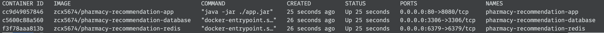

    - EC2에 도커, 도커 컴포즈를 설치한다
      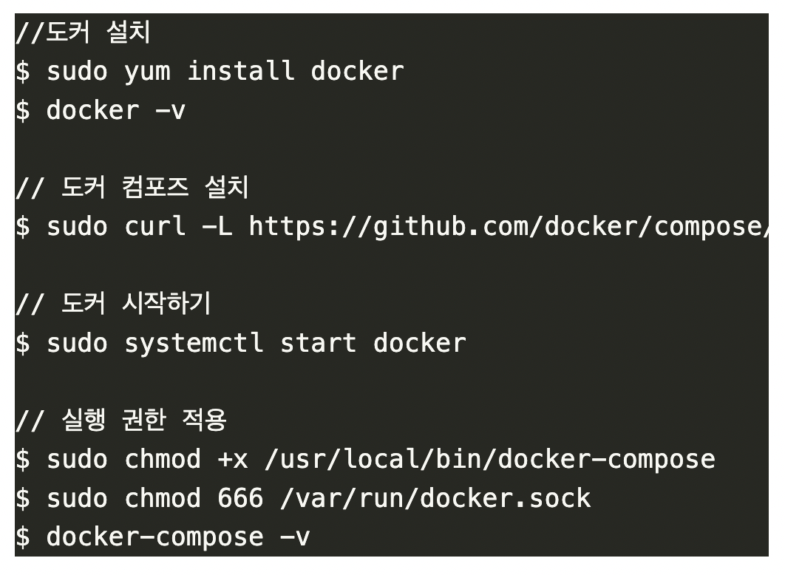

    - Docker Compose파일이 존재하는 소스 내려받기
      `$ git clone https://github.com/Ho-Tea/toy_project-Pharmacy.git`

    - Docker 환경변수
      - local에서 개발할 때, DB계정 정보나 외부에 노출되면 안되는 값들을 따로 제외하여 관리하였고<br> 이를 도커 컨테이너를 실행 할때 정달해주어야하는데 이때 .env파일을 사용할 수 있다
      - `docker-compose`를 사용할 때 .env라는 파일에 환경변수를 사용하면 자동으로 참조하여 사용할 수 있다

        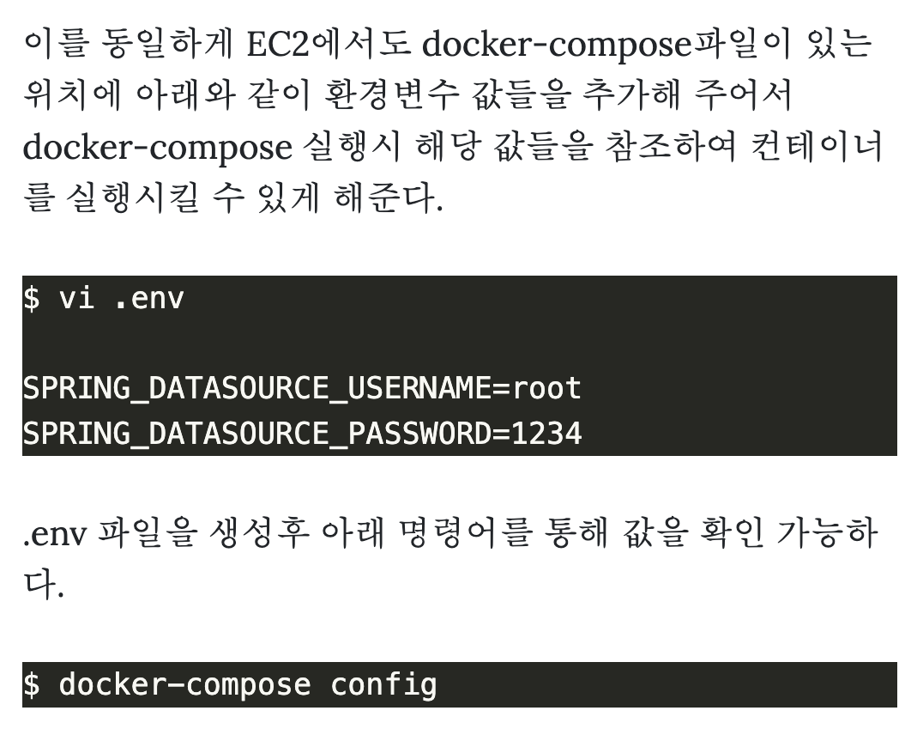

    - JDK설치 및 jar파일 생성

        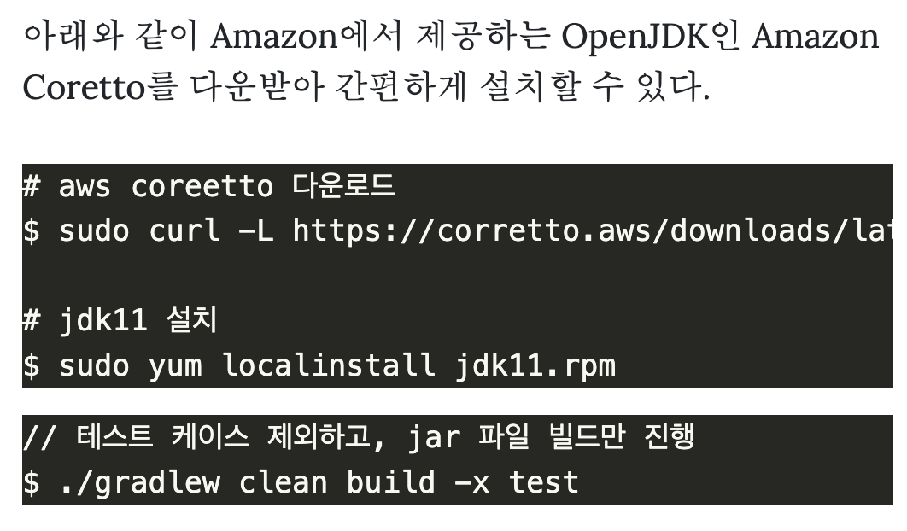

    - Docker이미지 받고 Docker Compose 실행

        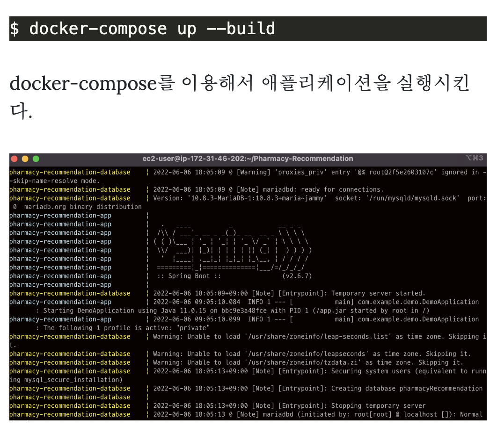


      


- ## Problem
  1. spock를 활용한 테스트컨테이너 작성시 `@SpringBootTest`추가와 `Specification`을 상속받음에도 불구하고<br> `Repository`를 `Autowired`하는 것에 실패하여 `null object`가 반환되는 문제가 발생 -> (**해결**)
    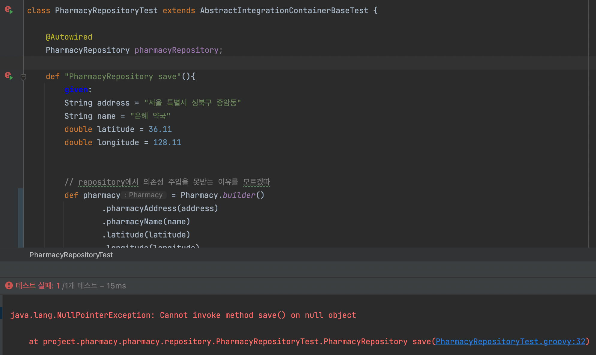

    - `spock`와 `Spring`의 버전차이로 인해 발생한 문제로 판명
    - `gradle.build`파일
      ``` groovy
      //spock
	    testImplementation('org.spockframework:spock-core:2.4-M1-groovy-4.0')
	    testImplementation('org.spockframework:spock-spring:2.4-M1-groovy-4.0')
      ```


  2. handlebars 템플릿 엔진을 이용하려고 했으나 `Controller`에서 뷰이름으로 `main.hbs` 파일을 인식하지 못해 화면구성 실패 -> (미해결)
    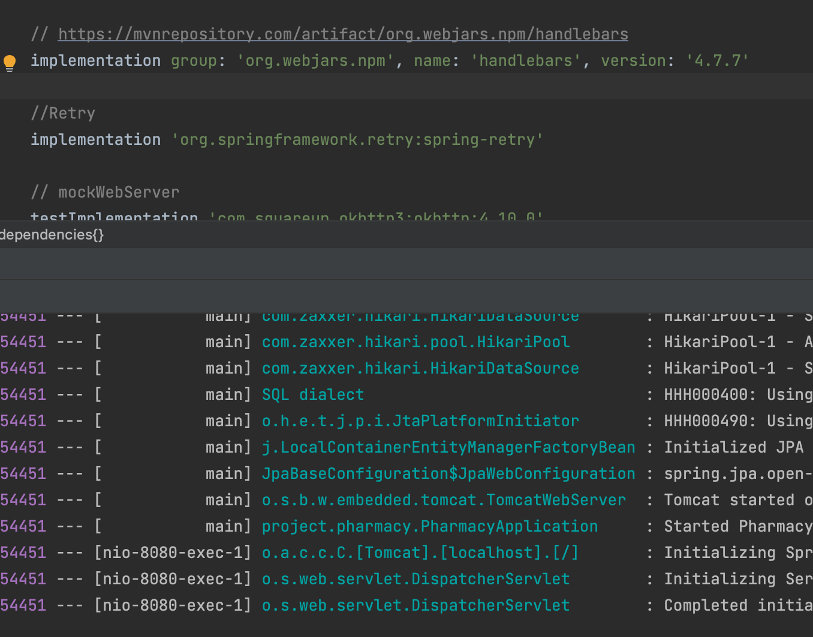


  3. 약국 데이터를 셋업하는 과정에서 지속하여 Empty set이 들어가는 현상이 발생 -> (**해결**)
    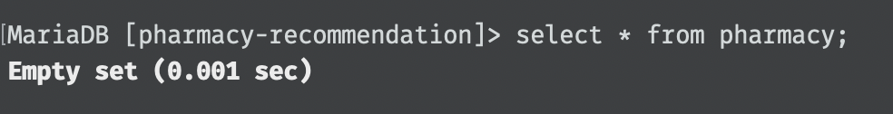
    - docker-container를 띄우는 과정에서 디렉토리 `/docker-entrypoint-initdb.d/`에 `.sql` 또는 `.sh`파일을 넣어두면 컨테이너 실행 시 시작된다
    - 이때 `jpa.hibernate.ddl.auto:validate`로 설정해놓아야 한다.


- [reference](https://wonyong-jang.github.io/posts/spring/)